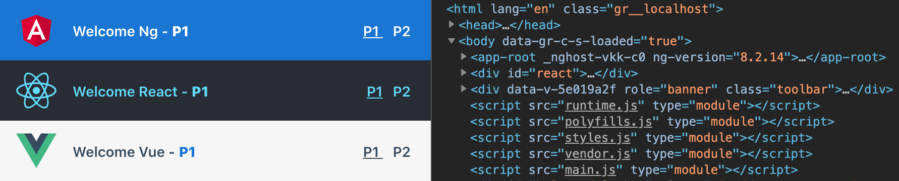

# Mix Project



測試修改使用 Angular CLI 產生的專案來同時支持 angular、react 以及 vue 在同一時間的編譯。先聲明此作法不應該用於實際專案上，畢竟一個網頁同時需要載入 angular、react、vue 三套 framework 實在是肥啊！如果真有此需求是不是應該回頭檢視一下為啥把網站搞成這樣...

至於如果使用 `ng g application <name>` 分別各自只包含單一 framework 會是稍微合理的做法，但實際 build size 是否為各框架的最佳壓縮尺寸則自行判斷，但如果想追求最小尺寸則推薦使用 [preact](https://github.com/preactjs/preact)。


## 如何於 Angular CLI 專案中設置支持 vue

- 首先使用 ng cli 創建自己適合的新專案。
- 安裝 **@angular-builders/custom-webpack**，並且依照[官方文件](https://github.com/just-jeb/angular-builders/tree/master/packages/custom-webpack)修改 **angular.json** 設定，目的是能自訂 webpack 配置。

```sh
yarn add @angular-builders/custom-webpack -D
```

- 安裝 vue 所需的相關 package。

```sh
yarn add vue-loader vue-template-compiler css-loader -D
yarn add vue vue-router
```

- 創建 [extra-webpack.config.js](extra-webpack.config.js) 並設定所需配置。最重要的步驟是將 ng 處理 css 的 rule 加入排除處理所有 `.vue` 的樣式，轉交由自定義 rule 來處理。
```js
// 尋找 postcss-loader 設定與修改與 css 相關之 rules
const postcssLoader = config.module.rules.reduce((result, rule) => {
  // 找出 postcss-loader 設定，目的是使用 ng cli 相同的設定
  if (rule.exclude && rule.test.test('.scss')) {
    result = rule.use.filter(loader => loader.loader === 'postcss-loader')[0];
  }
  // 排除所有針對來源 .vue 的處理
  if (rule.exclude) {
    if (rule.test.test('.css') || rule.test.test('.scss')) {
      rule.exclude = [ ...rule.exclude, /\.vue.(css|s[ac]ss)$/ ];
    }
    if (rule.test.test('.less')) {
      rule.exclude = [ ...rule.exclude, /\.vue.less$/ ];
    }
    if (rule.test.test('.styl')) {
      rule.exclude = [ ...rule.exclude, /\.vue.styl(us)?$/ ];
    }
  };

  return result;
}, 'postcss-loader');


// 加入處理 vue rules
config.module.rules.push(
  // vue-loader
  {
    test: /\.vue$/,
    loader: 'vue-loader'
  },
  // 只針對 .vue 來源之 style 處理
  {
    test: /\.vue.(css|s[ac]ss)$/,
    use: [
      'vue-style-loader',
      'css-loader',
      postcssLoader,
      'sass-loader'
    ]
  }, {
    test: /\.vue.styl(us)?$/,
    use: [
      'vue-style-loader',
      'css-loader',
      postcssLoader,
      'stylus-loader'
    ]
  }, {
    test: /\.vue.less$/,
    use: [
      'vue-style-loader',
      'css-loader',
      postcssLoader,
      'less-loader'
    ]
  }
);
config.plugins.push(
  new VueLoaderPlugin()
);
```

- 於 vue 檔案夾下創建 [vue-shim.d.ts](projects/app/src/vue/vue-shim.d.ts)，讓 .ts 能識別 .vue 的文件類型

```js
declare module "*.vue" {
  import Vue from "vue";
  export default Vue;
}
```

- 完成，直接執行就能於專案中 vue

```sh
yarn start
```

- `ng build --prod` 注意事項，發佈時 angular.json 中 buildOptimizer 需修改為 false，參考 [https://forum.vuejs.org/](https://forum.vuejs.org/t/it-works-in-development-but-not-in-production-mode-cannot-set-property-mustuseprop-of-undefined/51014/9)

## 如何於 Angular CLI 專案中設置支持 react

基本上 Angular CLI 所創建之專案預設已支援 .tsx 所以不用設定任何東西你便能直接於專案中使用 react，只需安裝相關的 package。


- 安裝 react 所需的相關 package。

```sh
yarn add @types/react @types/react-dom @types/react-router @types/react-router-dom -D
yarn add react react-dom react-router react-router-dom
```

- 完成，直接執行就能於專案中使用 react

```sh
yarn start
```

## 如果想於專案中使用 CSS Modules 設定方式

- `extra-webpack.config.js` 中特別定義啟用 CSS Modules 規則，這邊定義所有名稱為 `*.module.(css|scss|sass)` 的檔案來源即為想當作 CSS Modules 處理的來源。

```js
// 尋找 postcss-loader 設定與修改與 css 相關之 rules
const postcssLoader = config.module.rules.reduce((result, rule) => {
  // 找出 postcss-loader 設定，目的是使用 ng cli 相同的設定
  if (rule.exclude && rule.test.test('.scss')) {
    result = rule.use.filter(loader => loader.loader === 'postcss-loader')[0];
  }
  // 排除所有針對來源 .module.(css|s[ac]ss) 的處理
  if (rule.exclude && (rule.test.test('.css') || rule.test.test('.scss'))) {
    rule.exclude = [ ...rule.exclude, /\.module\.(css|s[ac]ss)$/i ];
  };

  return result;
}, 'postcss-loader');


// 加入處理 React CSS Modules rule
config.module.rules.push({
  test: /\.module\.(css|s[ac]ss)$/i,
  use: [
    'style-loader',
    {
      loader: 'css-loader',
      options: {
        modules: {
          localIdentName: '[local]-[hash:base64:5]',
        }
      }
    },
    postcssLoader,
    'sass-loader'
  ],
});
```

- 於 src 檔案夾下創建 typings.d.ts，讓 .ts 能識別 CSS Modules 的文件資料

```js
declare module '*.module.scss' {
  interface IClassNames {
    [className: string]: string
  }
  const classNames: IClassNames;
  export = classNames;
}
```

- 使用 CSS Modules

```js
import * as styles from './styles.module.scss';

<div className={styles.title}>
  ...
</div>
```
